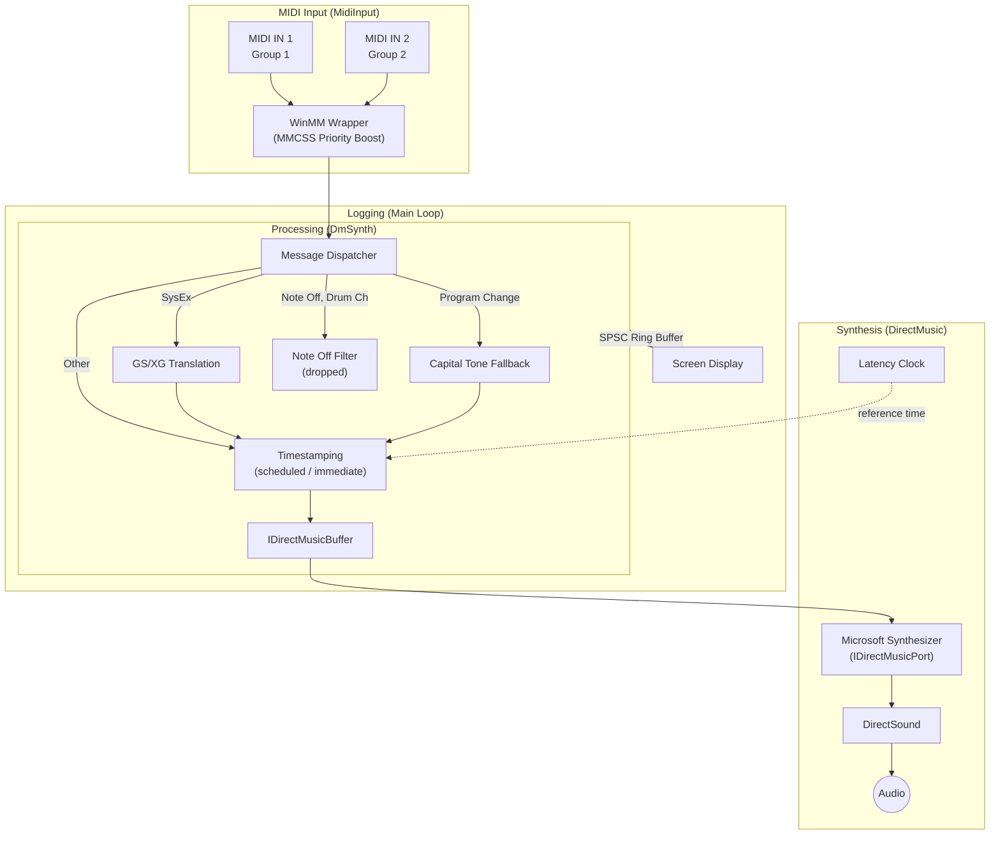

# DMSynth

A lightweight MIDI synthesizer proxy for Windows 10/11 that drives the native **DirectMusic** software synthesizer (`Microsoft Synthesizer`) via COM.

*An upgraded Microsoft GS Wavetable Synth, in your hands.*

## Features

- **Native DirectMusic** — COM interfaces redeclared from the original GUIDs and vtable layouts; builds with stock MSVC.
- **DLS instrument loading** — Loads GM instruments from `gm.dls` (system default or user-specified) at startup.
- **GS compatibility** — Translates incoming system messages:

  | Incoming | Translated to |
  |---|---|
  | GM System On (`F0 7E 7F 09 01 F7`) <br>or GM2 System On (`F0 7E 7F 09 03 F7`) | GS Reset |
  | GM System Off | GS Reset |
  | XG System On (`F0 43 10 4C ...`) | GS Reset |
  | XG Reverb / Chorus type changes | Similar GS Reverb / Chorus macro |

- **Capital Tone Fallback** — When a requested bank/patch is missing from the DLS, the closest available instrument is substituted by walking up the GS tone-map hierarchy (sub-capital → capital → any bank → first available). Drum kits fall back along the program number instead of the bank MSB.
- **Drum Note Off workaround** — Tracks GS "Use for Rhythm Part" SysEx; ignores Note Off on drum channels to prevent voices from being cut off prematurely if a Note Off message follows a Note On too closely.
- **32-channel MIDI** — Two MIDI inputs map to Channel Group 1 (CH 1 - 16) and Group 2 (CH 17 - 32).
- **Scheduled playback** — Outgoing MIDI is timestamped against DirectMusic's latency clock to absorb callback jitter.
- **Low-latency audio** — DirectSound output with MMCSS thread boosting on MIDI input.

### Comparison

| Feature | MSGS | **DMSynth** | VirtualMIDISynth |
| :--- | :--- | :--- | :--- |
| **Core Engine** | DirectMusic | **DirectMusic (Native COM)** | BASSMIDI |
| **Sound Format** | DLS (`gm.dls` only) | **DLS** | SF2 / SFZ |
| **Sample Rate** | 22,050 Hz | **44,100 Hz** (*) | 48,000 Hz (*) |
| **Voices** | 32 | **128** (1–1000 *) | 16–100,000 (*) |
| **Latency** | 150 ms | **Dynamic: Avg. 46 ms** (Min. 30 ms) | 0 ms (*) |
| **Capital Tone Fallback** | No | **Yes** | Yes |
| **Channels** | 16 | **32** (2 groups, shared engine) | 64 (4 independent groups) |

\* *Configurable*


## Requirements

- Windows 10 / 11 (x64 or x86)
- CMake 3.15+
- MSVC with C++17 support (Visual Studio 2019 or later recommended)

*Microsoft DirectX SDK (August 2007) is **not required** to build this project.*


## Building

```bash
mkdir build && cd build
cmake ..
cmake --build . --config Release
```

The binary is produced at `build/Release/dm_synth.exe`.

A `build.bat` script is also provided that builds both x64 and x86 in one step.

## Usage

```
dm_synth.exe [options]
```

Connect a MIDI device, launch the executable, and select your devices from the on-screen prompts. All prompts can be bypassed using command-line arguments for headless operation.

To use DMSynth as a drop-in replacement for the Microsoft GS Wavetable Synth, a virtual MIDI port is required to route MIDI from your application to DMSynth's input.
[loopMIDI](https://www.tobias-erichsen.de/software/loopmidi.html) works on Windows 10.
On the latest versions of Windows 11, [MIDI 2.0](https://github.com/microsoft/midi) changes may affect virtual port behavior — check compatibility before use.

### Options

| Option | Description |
|---|---|
| `--midi1 <idx\|name>` | MIDI IN 1 device (CH 1 - 16). Index number or partial device name (case-insensitive) |
| `--midi2 <idx\|name>` | MIDI IN 2 device (CH 17 - 32). `-1` to disable |
| `--port, -p <idx>` | Synthesizer port index |
| `--rate, -r <hz>` | Sample rate in Hz (default: 44100). Supported: 11025, 22050, 44100 |
| `--voices <n>` | Maximum polyphony (default: 128) |
| `--dls <path>` | Path to a DLS file (default: system `gm.dls`) |
| `--verbose, -v` | Enable MIDI event logging on startup |
| `--immediate` | Bypass timestamp scheduling and send events for immediate playback. Use when running alongside software like DirectMusic Producer, which can throttle DirectSound and cause scheduled playback to run slow |
| `--list` | List available devices/ports and exit |
| `--help, -h` | Show help and exit |

### Runtime keys

| Key | Action |
|---|---|
| `R` | Reset all MIDI state (All Sound Off + controller reset on every channel) |
| `V` | Toggle MIDI event log display |
| `Ctrl+C` | Quit |

### Examples

```bash
# List available devices
dm_synth.exe --list

# Single MIDI input, no second port
dm_synth.exe --midi1 0 --midi2 -1 --rate 44100

# Select by partial device name
dm_synth.exe --midi1 "Loopback (A)" --midi2 nanoKEY -v

# Custom DLS sound set
dm_synth.exe --dls "C:\soundfonts\my_gm.dls"
```

## Architecture



- **MidiInput** — WinMM wrapper with MMCSS priority boost and lock-free SysEx buffering.
- **DmSynth** — Processes MIDI messages including GS/XG translation, Capital Tone Fallback, and Note Off filtering. In scheduled mode each event is timestamped against the port's latency clock (auto-tuned at runtime) to absorb callback jitter; `--immediate` bypasses timestamping and sends events for immediate playback.
- **Main loop** — Manages log event draining via an SPSC ring buffer to ensure the high-priority MIDI thread remains non-blocking for real-time performance.

## License
Licensed under the [MIT License](LICENSE).
